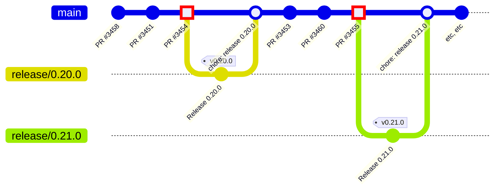

# Contribution guidelines

Directions to set up your project are available in the [README](../README.md).

Before you make your changes, check to see if an [issue exists](https://github.com/dfinity/agent-js/issues). If there isn't one, you can [create one](https://github.com/dfinity/agent-js/issues/new/choose) to discuss your proposed changes.

## Forking the repository

We use the [GitHub forking workflow](https://help.github.com/articles/fork-a-repo/) to manage contributions to this project. Please follow the steps below to create your own fork of this repository.

https://docs.github.com/en/get-started/quickstart/fork-a-repo#fork-an-example-repository

Once you have forked the repository, you can clone it to your local machine.

## Making Changes

Create a branch that is specific to the issue you are working on. If you have a GitHub Issue, use the issue number in the branch name. For example,

```
555-add-a-new-feature
```

Once you have a branch, you can make your changes and commit them to your local repository. In your commit message, please include a reference to the GitHub issue you are working on, formatted using [Conventional Commits](https://www.conventionalcommits.org/en/v1.0.0-beta.2/#examples). For example,

```
feat: adds a new feature
Closes #555
additional detail if necessary
```

This will automatically link your commit to the GitHub issue, and automatically close it when the pull request is merged.

Please document your changes in the [CHANGELOG.md](../CHANGELOG.md) file.

## Formatting

To save time on formatting, we use automated formatting for this repo using prettier. You can either use git pre-commit hooks or run the command `pnpm prettier:format` before submitting your PR to have your changes pass. We check formatting on CI.

We use GitHub Actions for Continuous Integration. As part of this, we have a workflow for releasing the package. This workflow is triggered manually and includes steps for checking out the code, setting up Node.js, installing dependencies, and running the release script.
To trigger the release workflow, go to the "Actions" tab in the GitHub repository, select the "Release" workflow, and click on "Run workflow".

## Continuous Integration (CI)

Changes will have to pass automated tests before they can be merged. If your changes fail the tests, you will have to address the failures and re-run the tests.

We use GitHub Actions for Continuous Integration. As part of this, we have a workflow for releasing the package. This workflow is triggered manually and includes steps for checking out the code, setting up Node.js, installing dependencies, and running the release script.
To trigger the release workflow, go to the "Actions" tab in the GitHub repository, select the "Release" workflow, and click on "Run workflow".

GitHub Actions for this repo are configured in [./workflows](./workflows).

- [build-and-test.yml](./workflows/build-and-test.yml) - builds the project and runs tests. It is triggered when a pull request is opened, reopened, edited, or synchronized. It runs tests for different test types: `unit`, `e2e`, and `mitm`.
- [conventional-commits.yml](./workflows/conventional-commits.yml) - checks the title of pull requests to ensure they follow a specified format. It is triggered when a pull request is opened, reopened, edited, or synchronized.
- [prepare-release.yml](./workflows/prepare-release.yml) - prepares a release by creating a pull request and a GitHub release. It is triggered manually through a workflow dispatch event. The user needs to specify the next SemVer version as an input when triggering the workflow.
- [publish.yml](./workflows/publish.yml) - used to publish and release a new version of the project. It is triggered when a pull request is closed and merged into the main branch, and the pull request's head branch starts with `release/`.

## Reviewing

A member of the team will review your changes. Once the member has reviewed your changes, they will comment on your pull request. If the member has any questions, they will add a comment to your pull request. If the member is happy with your changes, they will merge your pull request.

## Main Branch Conventions

All commits in the master branch should come from squashed GitHub Pull Requests, and those commit messages should follow the [conventionalcommits.org](https://conventionalcommits.org) syntax.

# Release new version and Publish it to NPM

> [!IMPORTANT]
> The 5-line script shared below should give you an overview of what you need to do to execute the process, however, it is **not recommended** to actually run it this way, because the script will approve and merge the PR - something you should do manually!
>
> ```
> gh workflow run "prepare-release.yml" -f "semverBump=major" && sleep 3
> RUN_ID=$(gh run list --workflow=prepare-release.yml --status in_progress --json databaseId --jq '.[0].databaseId')
> gh run watch $RUN_ID
> gh pr review $(gh pr list --json number --jq '.[0].number') --approve
> gh pr merge $(gh pr list --json number --jq '.[0].number')
> # ... and you're done with releasing and publishing!
> ```

## Release process

We utilize the [release-it](https://github.com/release-it/release-it) package to streamline our release process.

Start the process by initiating the GitHub Action Workflow `prepare-release.yml`. This can be done by:

- Navigating to the GitHub web UI and clicking "Run workflow" at https://github.com/smallstepman/agent-js/actions/workflows/prepare-release.yml, or
- Running this command from your console:
  ```console
  gh workflow run "prepare-release.yml" -f "semverBump=major"
  ```
  You can set `semverBump=...` to `prepatch`, `patch`, `preminor`, `minor`, `premajor`, `major`, or any valid SemVer like `0.31.3-beta.2`, `0.32.2-abcdef`, or `0.32.0`. View your workflow progress in the console with this command:
  ```console
  gh run watch $(gh run list --workflow=prepare-release.yml --status in_progress --json databaseId --jq '.[0].databaseId')`.
  ```

<details>
<summary>
  How does it work?
</summary>

The `prepare-release.yml` GitHub Actions workflow checks out the code, sets up Node.js, installs dependencies, and runs the release script via `release-it`. The process, defined in our `package.json` file, includes the following tasks:

- version bump,
- roll version in [CHANGELOG.md](../CHANGELOG.md),
- new release branch creation,
- git tag creation and push,
- suitable GitHub Release summary creation based on commit history,
- and release PR opening.

Looking at the process from perspective of git log, here is how it would look like



The commits with red square icon, indicate the moment when release process was triggered (either by using GitHub Actionr or by running `pnpm release`)

</details>

<details>
<summary>
  Can I trigger the release process without using GitHub Action?
</summary>

Yes, you can manually initiate the process. To do this, you must first install the GitHub CLI binary on your system and authenticate using `gh auth login`. After login, you can trigger the process using:

```console
GITHUB_TOKEN="$(gh auth token)" pnpm release patch # or minor/major/etc
```

</details>

<details>
<summary>
  How can I manually perform everything (bypassing `release-it`)?
</summary>

You can execute the following commands:

```console
# Ensure you are on main branch, and there are no uncommited files
VERSION="0.20.0"
ts-node bin/version.ts $VERSION
ts-node bin/roll-changelog.ts $VERSION

git pull
git checkout release/$VERSION 2>/dev/null || git checkout -b release/$VERSION
git merge main
git push --set-upstream origin release/$VERSION

git add .
git commit -m "chore: release 0.20.0"
git tag "v0.20.0"
git push --force-with-lease

RELEASE_URL=$(gh release create v0.20.0 --generate-notes)
gh pr create --base main --title 'chore: release $VERSION' --body 'GitHub Release: $RELEASE_URL\nNPM release: https://www.npmjs.com/package/@dfinity/agent/v/${version}'"
git checkout main
```

</details>

## Publishing to NPM and Document Updates

Once you've initiated a release process, the resulting pull request from the `release/...` branch to the `main` branch needs to be reviewed. Upon merging, it automatically triggers the `publish.yml` workflow, which handles publishing the new version to NPM, along with updating documentation and changelog.

<details>
<summary>
  How to manually publish to NPM (without utilizing `publish.yml` workflow)?
</summary>

Perform the following steps to manually publish a package to NPM:

1. Create a branch and execute these commands:
   - `git clean -dfx`. This removes all non-tracked files and directories.
   - `pnpm i`. This ensures everything is installed and up-to-date locally.
   - `pnpm build`. This builds all applications and packages.
   - `pnpm version [patch|major|minor|version]`. This updates the version in each package.
   - Manually update the version in the root package.json file.
   - `pnpm i`. This updates the packages' versions in the package-lock.json file.
2. Initiate a new release branch using `git checkout -b release/v<#.#.#>`.
3. Stage your changes with `git add .`.
4. Create a commit including your changes using `git commit -m 'chore: release v<#.#.#>'`.
5. Open a pull request from your fork of the repository.

Once the changes are merged, you can publish to NPM by running:

- `pnpm build`. Re-building for safety.
- `pnpm publish`. To publish packages to NPM.
  - To do this, you will need publishing authorization under our NPM organization. Contact IT if you require access.
  - You can include the `--dry-run` flag to verify the versions and packages before actual publishing.

After publishing to NPM, go to https://github.com/dfinity/agent-js/releases/new, select "Draft a new release", enter the new tag version (in `v#.#.#` format), and click "Publish release".

</details>

<details>
<summary>
  How to manually publish a new version of the documents (without utilizing `publish.yml` workflow)?
</summary>

1. Start with a fresh clone (or execute `git clean -dfx .`)
2. Run `pnpm i`
3. Execute `pnpm make:docs`
4. Deploy the docs using `dfx deploy --network ic`. Note: You may need to request for permissions as a controller for the wallet that owns the docs.

</details>

# Deprecation

To deprecate a package, follow these steps

- Remove all contents except the package.json, license, and readme
- Add a note to the README saying `**Warning** this package is deprecated`
- Remove unnecessary content, dependencies, and metadata from the package.json
- add a `"deprecation"` tag to the package.json with instructions you want users to follow in migrating
- remove the package as a workspace from the root `package.json`
- the next time that agent-js releases, manually publish a new version of newly deprecated packages by incrementing the patch version and running `pnpm publish`

So far, the following packages were deprecated:

- @dfinity/ledger-identityhq (#665)
- @dfinity/authentication (#665 & #661)
